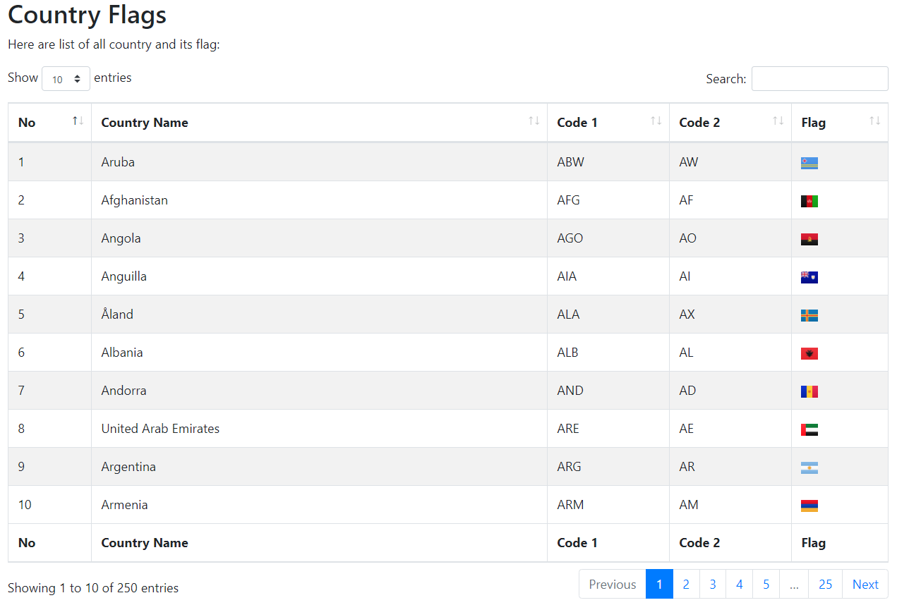

Country Data, Country Code and Country Flag in Mysql Database with PHP Example
---------

All country in world in Mysql database. Data that provided in this database are country name, country code, domain code, and flag image of each country. This project also added some example of the use of database in PHP. The example shows web interfaces that show all data with bootstrap data table.

## Credit
Thanks to:
- madebybowtie for https://github.com/madebybowtie/FlagKit that provide the flag images.
- yusufshakeel for https://github.com/yusufshakeel/mysql-country-with-flag that provide the initial database.